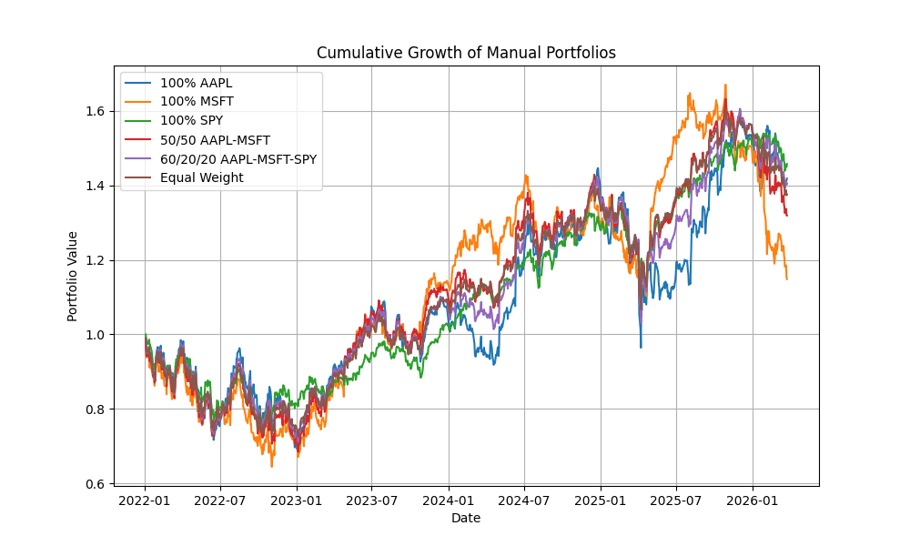
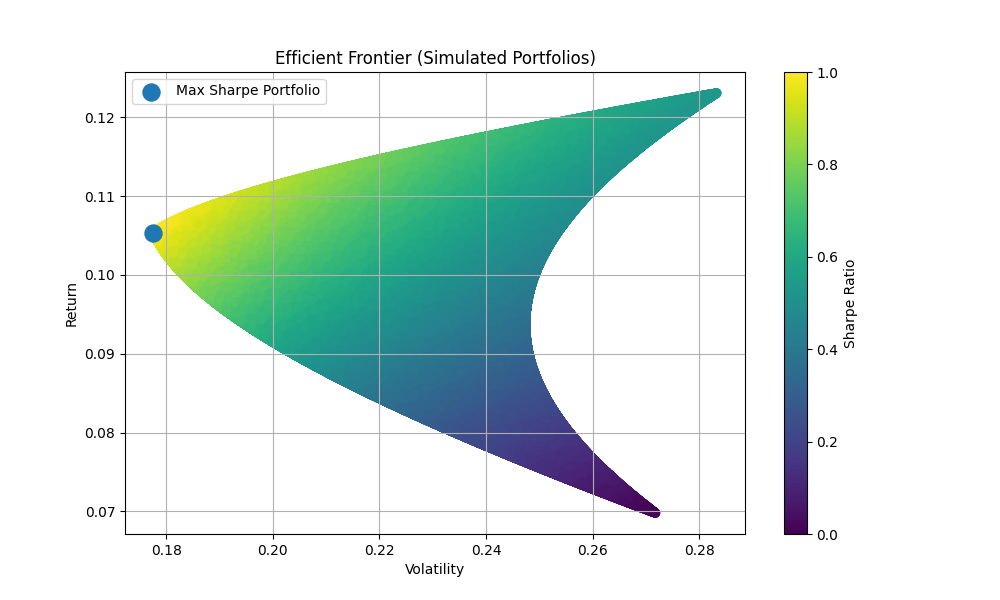

# Portfolio Optimization and Efficient Frontier Analysis
This project investigates portfolio construction using historical equity data from Yahoo Finance.
It evaluates multiple asset allocations and simulates 10,000 random portfolios to study the tradeoff between expected return and volatility.
The goal is to identify optimal portfolios using the Sharpe ratio and visualize the efficient frontier.

---

## Assets

- AAPL (Apple Inc.)
- MSFT (Microsoft Corp.)
- SPY (S&P 500 ETF)

---

## Methods

- Retrieved historical adjusted closing prices using `yfinance`
- Computed daily simple returns for each asset
- Constructed baseline portfolios with predefined weight allocations
- Implemented a Monte Carlo simulation of 10,000 randomly generated portfolios (weights normalized to sum to 1)
- Calculated annualized return and volatility (assuming 252 trading days)
- Evaluated portfolio performance using the Sharpe ratio
- Visualized the efficient frontier and identified the maximum Sharpe ratio portfolio

The Monte Carlo simulation uses a fixed random seed to ensure reproducibility of portfolio sampling and results.

---

## Mathematical Formulation

Portfolio expected return is computed as:

E[R_p] = w^T μ

Portfolio volatility is computed as:

σ_p = sqrt(w^T Σ w)

where:
- w is the vector of portfolio weights
- μ is the vector of annualized expected returns
- Σ is the annualized covariance matrix of asset returns

---

## Results and Analysis

- The S&P 500 ETF (SPY) achieved the highest Sharpe ratio among manually constructed portfolios
- Individual equities (e.g., AAPL) generated higher raw returns but exhibited substantially higher volatility, reducing risk-adjusted performance
- Diversified portfolios reduced volatility but did not outperform SPY under naive weighting schemes
- Simulation identified portfolios with superior Sharpe ratios, demonstrating that optimal allocation requires systematic optimization rather than heuristic diversification
  
- Maximum Sharpe portfolio: Sharpe ≈ 0.592, Return ≈ 10.54%, Volatility ≈ 17.82%
- Optimal weights: AAPL 1.23%, MSFT 0.47%, SPY 98.30%

The optimal portfolio is heavily weighted toward SPY, reflecting its lower volatility and strong risk-adjusted performance relative to individual equities.

---

## Interpretation

This analysis demonstrates that portfolio performance must be evaluated on a risk-adjusted basis. 
While individual assets may generate higher returns, their volatility reduces overall efficiency. 
Monte Carlo simulation enables systematic exploration of the allocation space, revealing portfolios that outperform naive allocations.

---

## Limitations

This analysis is based on historical returns and assumes stationarity of asset behavior. 
Results are sensitive to the chosen time period and do not account for transaction costs, market impact, or changing correlations.

---

## Visualizations

### Manual Portfolio Growth


### Efficient Frontier


---

## How to Run

```bash
pip install -r requirements.txt
python portfolio_optimization.py
